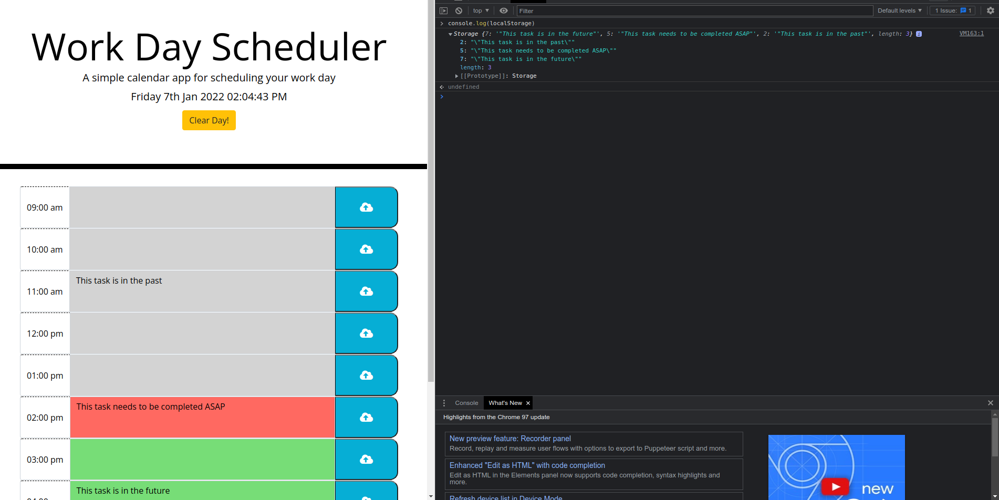

# About The Project:

This is a taskamanger tool that was created to keep track of the work day hours. It uses the help of JQuery, Moment.js and Bootstrap. The idea behind it is that you can save a task in the time slot and it will save to local storage which will persist through refreshes. There is an option to clear the day to start over.

# Built With:

- HTML
- CSS
- JavaScript

# Frameworks:

- JQuery
- Bootstrap
- Moment.js

# Getting Started:

In order to run this project you need to click the develop link: https://benjamind10.github.io/task-manager/

# Demo:

## 

# How To Use:

## 
